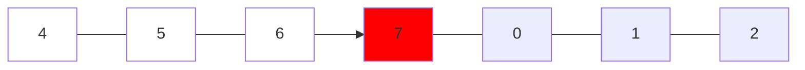
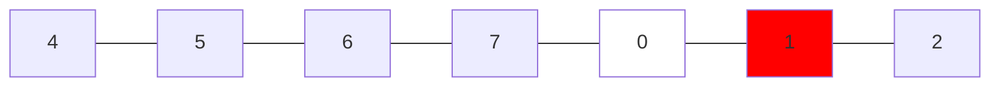

### [33. Search in Rotated Sorted Array]

Binary search 的變種，但 33. 是一個 unique array，並且旋轉方向是將 k 之後的數字移到前面，
在這種條件下如果找到 mid 之後必然有一邊是 sequential 的，可以利用這個特性來思考解題方式。

1.  找到 mid 之後與 left 比較，如果 mid >= left 代表左邊是 sequential array
    -   如果比 left 小，則代表右邊必然是 sequential array
    -   這裡可以把 mid 改成 0 試想看看



2.  假設 target 是 0，所以 target 不在左側，把 left 移動到 mid + 1，然後繼續找
    -   此時發現 left >= target, mid > target, 所以 target 在左側，把 right 移動到 mid - 1，然後繼續



3.  此時 left == right, mid == target，找到 target
	-   如果此時也沒找到，left 會大於 right，return -1

---

Solution 1:
```go
func search(nums []int, target int) int {
	left, right := 0, len(nums)-1

	for right >= left {
		mid := (right - left) / 2 + left
		if nums[mid] == target {
			return mid
		}
		if nums[mid] >= nums[left] {
			if  target < nums[mid] && target >= nums[left] {
				right = mid - 1
			} else {
				left = mid + 1
			}
		} else {
			if target > nums[mid] && target <= nums[right] {
				left = mid + 1
			} else {
				right = mid - 1
			}
		}
	}
	return -1
}
```

[33. Search in Rotated Sorted Array]: https://leetcode.com/problems/search-in-rotated-sorted-array/description/