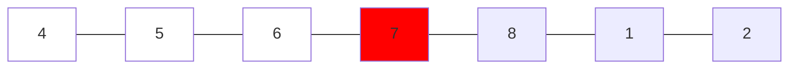
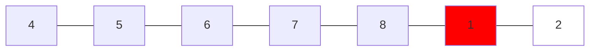
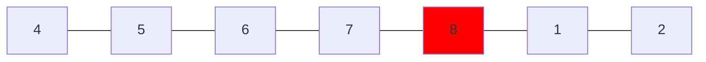
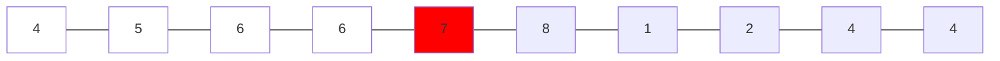
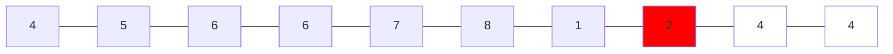
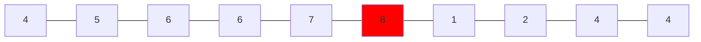
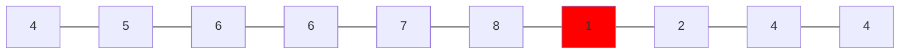

### [33. Search in Rotated Sorted Array]

Binary search 的變種，但 33. 是一個 unique array，並且旋轉方向是將 k 之後的數字移到前面，
在這種條件下如果找到 mid 之後必然有一邊是 sequential 的，可以利用這個特性來思考解題方式。

1.  找到 mid 之後與 left 比較，如果 mid > left 代表左邊是 sequential array
    -   如果比 left 小，則代表右邊必然是 sequential array
    -   這裡可以把 mid 改成 0 試想看看
	-	假設 target 是 8，所以 target 不在左側，把 left 移動到 mid + 1，然後繼續找



2.  此時 mid 移動到 1, mid < left 所以代表右側是 sequential array
	-   但是右側的 sequential array 沒有包含 target，所以把 right 移動到 mid - 1，然後繼續找



3.  此時 left == right, mid == target，找到 target
	-   如果此時也沒找到，繼續操作 left 會大於 right，return -1



這樣就可以保持 time complexity 在 **O(log n)**。

---

Solution 1:
```go
func search(nums []int, target int) int {
	left, right := 0, len(nums)-1

	for right >= left {
		mid := (right - left) / 2 + left
		if nums[mid] == target {
			return mid
		}
		if nums[mid] >= nums[left] {
			if  target < nums[mid] && target >= nums[left] {
				right = mid - 1
			} else {
				left = mid + 1
			}
		} else {
			if target > nums[mid] && target <= nums[right] {
				left = mid + 1
			} else {
				right = mid - 1
			}
		}
	}
	return -1
}
```

---

### [81. Search in Rotated Sorted Array II]

33 題的延續，這次有可能出現重複的數字，所以在判斷時不能以一個中間值來判斷左右是否是 sequential array，
下面的例子以 target 為 1 來說明。

1.	mid 找到 7，先跟左邊比較發現 mid > left，所以左邊是 sequential array
	-	但是左邊的 sequential array 並沒有包含 target，所以把 left 移動到 mid + 1，然後繼續找



2. mid 找到 2，mid < left 所以左邊不是 sequential array
	-	跟右邊比較發現 mid > right，右邊是 sequential array，但是 target 不在右邊
	-	都沒找到 target 所以 right = mid - 1



3.	mid = 8，左邊是 sequential array，但是左邊的 sequential array 也就是 8 自己
	-	但沒有包含 target，所以 left = mid + 1



4.	left = right = 1，mid = 1，找到 target



---

下面這個解法是在 33 題的基礎上加上了重複數字的判斷，依然在 nums[mid] < nums[right] 時判斷右邊是 sequential array，
實際上在遇到 [13, 14], [14, 13, 13] 這種情況時，會有一些問題，這裡很粗暴的去直接先比較 Left 和 Right，時間複雜度算不上好。

Testcase:
```go
type TestCase struct {
	Nums   []int
	Target int
	Result bool
}

nums_set := []TestCase{
	{Nums: []int{2, 5, 6, 0, 0, 1, 2}, Target: 0, Result: true},
	{Nums: []int{2, 5, 6, 0, 0, 1, 2}, Target: 3, Result: false},
	{Nums: []int{1, 1, 1, 1, 1, 1, 1, 13, 1, 1, 1, 1, 1}, Target: 13, Result: true},
	{Nums: []int{1, 1, 1, 1, 13, 1, 1, 1, 1, 1, 1, 1, 1}, Target: 13, Result: true},
	{Nums: []int{14, 13}, Target: 13, Result: true},
	{Nums: []int{13, 14}, Target: 13, Result: true},
	{Nums: []int{3, 1, 1, 1}, Target: 3, Result: true},
}
```

Solution 1:
```go
func search(nums []int, target int) bool {
	left, right := 0, len(nums)-1

	for right >= left {
		mid := (right-left)/2 + left
		// If we found the target on mid, left or right then return true
		if nums[mid] == target || nums[left] == target || nums[right] == target {
			return true
		}
		// Mid > Left mean left is sequential array
		if nums[mid] > nums[left] {
			// If target is in the left sequential array then move search range to left
			// Otherwise move search range to right
			if target >= nums[left] && target < nums[mid] {
				right = mid - 1
			} else {
				left = mid + 1
			}
		} else if nums[mid] < nums[right] {
			// If target is in the right sequential array then move search range to right
			// Otherwise move search range to left
			if target > nums[mid] && target <= nums[right] {
				left = mid + 1
			} else {
				right = mid - 1
			}
		// Like [1, 3, 1, 1, 1] then move right--
		} else if nums[left] == nums[right] {
			right-- 
		// Like [1, 3, 1, 1, 1] then move left++
		} else {
			left++
		}
	}
	return false
}
```

[81. Search in Rotated Sorted Array II]: https://leetcode.com/problems/search-in-rotated-sorted-array-ii/description/

[33. Search in Rotated Sorted Array]: https://leetcode.com/problems/search-in-rotated-sorted-array/description/