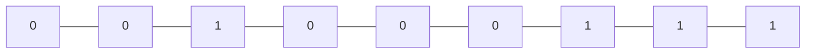

### [525. Contiguous Array]

這題要注意的是如果出現下面這種情況，也就是最長的 0-1 序列並不是從頭開始的，就會需要使用 [Prefix Sum]。



### Start from scratch

這邊我們先考慮一個簡單的情況，假如 0-1 序列都是從頭開始的，那我們可以把 0 當成 -1，這樣就可以使用一個 sum 來記錄目前的加總，當 sum 為 0 的時候就代表記錄到目前為止的 0-1 序列是平衡的，這時候就可以使用 index 來更新最長的長度。

```go
func findMaxLength(nums []int) int {
    for i := range nums {
        if nums[i] == 0 {
            nums[i] = -1
        }
    }
    sum, res := 0, 0
    for i := range nums {
        sum += nums[i]
        if sum == 0 {
            res = i + 1
        }
    }
    return res
}
```

但是這樣的題目再遇到之前的例子的時候會出錯，例如 `[0,0,1,0,0,0,1,1]` 這個例子上不會出現 sum 為 0 的情況，
所以就需要使用 Prefix sum 來記錄目前的加總。

---

### Prefix Sum

回到這個例子，如果我們把 sum 連續紀錄下來會得到下面的例子，這裡我們去觀察 sum 之間的關係:
-	當 sum 重複出現時就代表 sum 之間的序列是平衡的
	-	nums[1] 到 nums[3]，此時 nums[3] 回到 -2 代表中間經過了相等的 `0,1`
	-	nums[1] 到 nums[7]，也是一樣的情況
-	所以我們只要記錄最早出現的那一次 sum，並且用 hash table 來記錄，這樣就能解決 0,1 序列不是從頭開始的情況


現在我們把最初的方法與使用 Prefix sum 的方法結合起來，這樣就能得到下面的演算法:
1.	使用一個 sum 紀錄當下的加總
	-	如果 sum 為 0 就更新最長的長度，會為 0 的情況一定是從頭開始的序列
2.	使用 hash table 來記錄 Prefix sum 的 index
	-	這樣就能找到不是從頭開始的序列
3.	持續更新 Prefix sum 的 index

Time Complexity O(n).

Solution:
```go
func findMaxLength(nums []int) int {
	for i := range nums {
		if nums[i] == 0 {
			nums[i] = -1
		}
	}
	hash := map[int]int{}
	res, sum := 0, 0
	for i := range nums {
		sum += nums[i]
		if sum == 0 {
			res = i + 1
		} else if _, exist := hash[sum]; exist {
			res = IntMax(res, i-hash[sum])
		} else {
			hash[sum] = i
		}
	}
	return res
}

func IntMax(a, b int) int {
	if a > b {
		return a 
	}
	return b
}
```

[525. Contiguous Array]: https://leetcode.com/problems/contiguous-array/description/
[Prefix Sum]: https://en.wikipedia.org/wiki/Prefix_sum